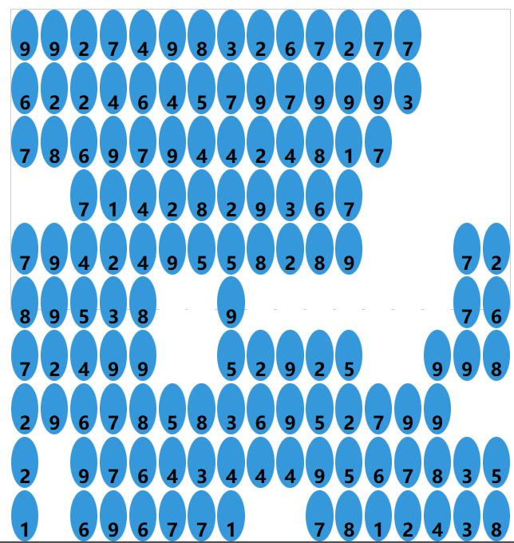

# Digit-Elimination
### Current version: 1.0

A small game Demo imitating Fruit Box

### Fruit Box: https://en.gamesaien.com/game/fruit_box/

### Digit Elimination

This is an H5 mini game Demo modeled after Fruit Box.

There are some problems: 
1. cannot handle such as (| 1 1 | 1 7 |) This 2 x 2 or more case.

2. The matrix checked out by the mouse is not displayed.

3. Lack of art resources.

4. Timer scoreboard not added.
